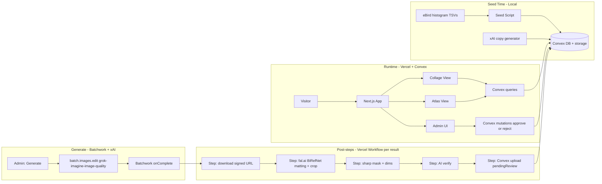

# Birds in Ueno — Collage Fork Plan

> Trilingual (EN / JA / ZH-TW) curated bird guide for Ueno Park, Tokyo.
> Fork target: [AvianVisitors](https://github.com/Twarner491/AvianVisitors) collage UI + kachō-e illustrations.
> Stack: TypeScript, Next.js, Convex, Vercel.
> Domain language lives in [CONTEXT.md](CONTEXT.md); hard-to-reverse decisions in [docs/adr/](docs/adr/).

## Implementation checklist

- [ ] Scaffold Next.js + Convex + Convex Auth at workspace root; ESLint + Tailwind v4
- [ ] Define Convex schema (species, prevalence) + public queries + authed admin mutations
- [ ] Seed pipeline: parse eBird histogram TSVs (Ueno Park + Shinobazu Pond) into per-season Prevalence; manual review export
- [ ] Port apt.js bitmask collage packing to TypeScript React component with season picker
- [ ] Build atlas list + species detail pages (trilingual bird data, EN+JA chrome)
- [ ] Build `/about` (Prevalence methodology, eBird source, illustration + AvianVisitors credits)
- [ ] Build asset-generation: Batchwork + xAI edit bulk generate → durable post-steps (fal matting, sharp mask, AI verify, Convex upload)
- [ ] Offline script to generate trilingual descriptions and spotting tips via xAI (EN / JA / ZH-TW) at seed time
- [ ] Convex Auth-protected admin UI with field-level provenance (curated vs seeded)
- [ ] Port AvianVisitors visual design (cream ground, typography, tooltips) — light only, no dark mode
- [ ] Deploy to Vercel + Convex; add AvianVisitors attribution footer

---

## What we're building

A regional bird showcase for **Ueno Park, Tokyo** — visually forked from [AvianVisitors](https://github.com/Twarner491/AvianVisitors) (reference clone in [`temp/`](temp/)), reimplemented as a modern web app. Not a BirdNET-Pi deployment; a **curated static guide** where collage bird size reflects **Prevalence** (per-species, per-season encounter frequency from eBird histogram data), filtered by **season**.



## Decisions locked in (grill sessions)

| Decision | Choice |
|----------|--------|
| Data model | Curated regional guide (not live mic) |
| Collage sizing | **Prevalence**: one 0–100 value per species per season, drives both membership and size |
| Prevalence source | eBird histogram TSV download (one-time, manual) from Ueno hotspots; weeks → Seasons via **max** weekly frequency (not mean); meteorological boundaries (Dec–Feb / Mar–May / Jun–Aug / Sep–Nov) |
| Hotspots | Merge **L920322** (Ueno Park) + Shinobazu Pond hotspot, max frequency per species per week |
| Illustrations | **Batchwork** `batch.images.edit()` + xAI `grok-imagine-image-quality` (refs as URLs); **Vercel Workflow** for post-steps only — see [ADR-0003](docs/adr/0003-asset-generation-via-vercel-workflow.md) |
| Illustration storage | **Convex file storage** for cutouts; mask bits + dims stored per species doc, written by the workflow — see [ADR-0002](docs/adr/0002-illustrations-in-convex-storage.md) |
| Background removal | Hosted BiRefNet via fal.ai (AI SDK provider) — cream ground kept, matting is a retryable API step |
| Generation references | Anatomy + Koson/Yoshida style prints; anti-refs dropped; passed into xAI edit as **stable public HTTPS URLs** (not short-lived Convex signed URLs) |
| Quality gate | AI verify in post-Workflow via **xAI vision** (AI SDK; retry once per pose, then species `failed` — fails closed) + human approval post-run |
| Batch shape | Batchwork job for generate; **per-pose** Vercel Workflow on each result (download ASAP); species → `pendingReview` only when **both** poses succeed; **approve/reject the pair**; regen flips to `generating` immediately |
| UI scope | Collage + Atlas + **`/about`** (methodology + credits); **`/` = Collage**, `/atlas` = catalog |
| Top filter | Seasons; **default = current Season in `Asia/Tokyo`**, plus All-year tab (Prevalence = seasonal max) |
| Language | Bird data trilingual EN / JA / ZH-TW; UI chrome bilingual EN + JA |
| Runtime AI | None — AI only in build pipeline |
| Species copy | Offline at seed time via **xAI** (trilingual description + spotting tips); admin edits mark curated |
| v1 target | ~60–70 **Guide species** (wild regularly-occurring only; drop escapes/domestics/one-off vagrants; ferals OK if multi-season) |
| Content editing | Admin UI with **field-level provenance**; admin can create Guide species; **soft-hide (Listed)** instead of hard delete; re-seed never flips `listed` |
| Slug | Derived from `sciName` at create; **immutable afterward** (taxonomy edits don't rewrite URLs) |
| `featured` flag | Dropped from v1 |
| Missing approved art | Hide from collage; still listed in atlas (text + Prevalence) |
| Empty collage | Quiet empty state + link to Atlas (no auto All-year fallback, no placeholders) |
| Collage membership | Prevalence `value > 0` for the selected Season (or seasonal max for All-year); no secondary floor — escapes/vagrants dropped at species-list review |
| Stack | TypeScript, Next.js, Convex, Vercel — see [ADR-0001](docs/adr/0001-convex-backend-for-curated-content.md) |

## Reference material (already in repo)

The [`temp/avian/`](temp/avian/) directory is the fork source — do not deploy it as-is; port selectively:

- **Collage algorithm**: [`temp/avian/frontend/apt.js`](temp/avian/frontend/apt.js) — bitmask nesting, count-weighted area, perched/flight poses (~lines 400–500); `slugify()` at line 280 is the canonical Slug rule
- **Visual design**: [`temp/avian/frontend/styles.css`](temp/avian/frontend/styles.css), [`index.html`](temp/avian/frontend/index.html) layout
- **Mask data**: [`masks.json`](temp/avian/frontend/masks.json), [`dims.json`](temp/avian/frontend/dims.json)
- **Illustration pipeline**: [`temp/avian/scripts/`](temp/avian/scripts/) — `pregen.py`, `cutout.py`, `build_masks.py`, [`prompt.template.md`](temp/avian/scripts/prompt.template.md)
- **Live demo**: [bird.onethreenine.net](https://bird.onethreenine.net)

Credit AvianVisitors / [theodore.net](https://theodore.net) in site footer.

---

## Phase 1 — Project scaffold

Create greenfield app at workspace root (not inside `temp/`):

```
birds-in-ueno/
├── app/                    # Next.js App Router
├── components/
│   ├── collage/            # Ported packing + render
│   └── atlas/
├── convex/
│   ├── schema.ts
│   ├── species.ts          # Public queries
│   ├── admin.ts            # Authed mutations
│   └── lib/auth.ts
├── workflows/
│   └── generate-illustration.ts  # "use workflow" — per-species asset pipeline
├── scripts/
│   └── seed-histogram.ts   # eBird histogram TSV → Convex import
├── data/
│   └── ebird/              # Downloaded histogram TSVs (checked in)
├── CONTEXT.md              # Domain glossary
├── docs/adr/               # Architectural decisions
└── temp/                   # Read-only reference
```

**Setup tasks:**

- `create-next-app` with TypeScript, Tailwind v4, App Router
- `npx convex dev` — init Convex project
- Convex Auth (**GitHub OAuth**); gate admin mutations with env allowlist of GitHub user id(s)
- ESLint with `@convex-dev/eslint-plugin`
- `next.config` `images.remotePatterns` for Convex storage URLs
- Workflow DevKit: `workflow` package + `withWorkflow` in `next.config`; AI SDK + `@ai-sdk/xai` + `batchwork` + fal provider
- Env vars: `XAI_API_KEY`, `FAL_KEY`, Batchwork webhook secret, Convex/Vercel keys (no eBird API key — histogram is a manual download; no Gemini key)

---

## Phase 2 — Convex schema

Flat relational design in `convex/schema.ts`. Terminology per [CONTEXT.md](CONTEXT.md): **Prevalence** is the single per-species-per-season frequency (0–100); there is no separate commonness score or likelihood enum.

```typescript
species: defineTable({
  sciName: v.string(),
  comNameEn: v.string(),
  comNameJa: v.string(),
  comNameZhTw: v.string(),          // Traditional Chinese common name (繁體中文)
  descriptionEn: v.optional(v.string()),
  descriptionJa: v.optional(v.string()),
  descriptionZhTw: v.optional(v.string()),
  spottingTipsEn: v.optional(v.string()),
  spottingTipsJa: v.optional(v.string()),
  spottingTipsZhTw: v.optional(v.string()),
  illustrationPerch: v.optional(v.id("_storage")),   // Convex file storage
  illustrationFlight: v.optional(v.id("_storage")),
  maskPerch: v.optional(v.object({ w: v.number(), h: v.number(), bits: v.string() })),  // 1-bit silhouette, base64
  maskFlight: v.optional(v.object({ w: v.number(), h: v.number(), bits: v.string() })),
  dimsPerch: v.optional(v.array(v.number())),   // [w, h], long side 560
  dimsFlight: v.optional(v.array(v.number())),
  illustrationStatus: v.union(
    v.literal("queued"), v.literal("generating"),
    v.literal("pendingReview"), v.literal("approved"), v.literal("failed")
  ),
  anatomyRef: v.optional(v.id("_storage")),     // admin-overridable Wikipedia photo
  slug: v.string(),                 // slugify(sciName) at create; immutable afterward
  listed: v.boolean(),              // false = soft-hidden; omitted from public collage/atlas
  curatedFields: v.array(v.string()), // field names hand-edited in admin; re-seed skips these
})
  .index("by_slug", ["slug"])
  .index("by_listed", ["listed"])

prevalence: defineTable({
  speciesId: v.id("species"),
  season: v.union(
    v.literal("winter"), v.literal("spring"),
    v.literal("summer"), v.literal("autumn")
  ),
  value: v.number(),                // 0–100; 0 = absent that season
  curated: v.boolean(),             // hand-edited; re-seed skips
})
  .index("by_season", ["season"])
  .index("by_species_and_season", ["speciesId", "season"])
```

**Key queries:**

- `listForCollage({ season })` — **Listed** species with `prevalence.value > 0` for the season (or seasonal max for All-year) **and** `illustrationStatus === "approved"`, returns `{ sci, comEn, comJa, comZhTw, n: prevalenceValue, slug, perchUrl, flightUrl }` with storage URLs resolved
- `getSpecies({ slug })` — atlas detail page (Listed seeded species only; unlisted → null)
- `listAtlas({ season? })` — browseable **Listed** species list sorted by Prevalence (includes species awaiting art)

Season is always passed as an argument (never `Date.now()` inside queries); the client computes the current Season in the **`Asia/Tokyo`** timezone.

**Admin mutations** (Convex Auth gated via custom function wrappers):

- CRUD species (including create beyond the histogram seed); edit all three common names, descriptions, Prevalence values
- New species: all editable fields start as curated; Slug derived once from `sciName` at create; `listed: true`
- Soft-hide / restore via `listed` (no hard delete in admin)
- Every admin edit appends the field name to `curatedFields` (or sets `prevalence.curated`)
- Attach/replace illustration storage IDs

---

## Phase 3 — Prevalence seed pipeline

The eBird REST API has **no frequency endpoint** — histogram (bar chart) data is only available as a TSV download from hotspot pages. Script at `scripts/seed-histogram.ts`:

1. **Manual step**: download "Histogram data" TSVs from eBird for **L920322 (Taito Ward--Ueno Park)** and the **Shinobazu Pond** hotspot; commit to `data/ebird/`
2. Parse weekly frequency per species from both TSVs; merge by taking the max per species per week
3. Aggregate 48 weeks into 4 Seasons using **max** weekly frequency per season (meteorological: Dec–Feb / Mar–May / Jun–Aug / Sep–Nov), normalize to 0–100 Prevalence
4. Trim to **Guide species** — drop escapes, domestics, and one-off vagrants; keep established ferals with multi-season signal; expect **~60–70**
5. Seed **Japanese** names from [`labels_ja.json`](temp/model/l18n/labels_ja.json), **Traditional Chinese** names from [`labels_zh_TW.json`](temp/model/l18n/labels_zh_TW.json) (both keyed by scientific name; some ZH-TW entries fall back to English)
6. Upsert into Convex via internal mutation, **skipping any field listed in `curatedFields`**, any `prevalence` row with `curated: true`, and **never touching `listed`** (soft-hide survives re-seed)

**Manual review checkpoint** before illustration pipeline: export CSV with `sciName`, `comNameEn`, `comNameJa`, `comNameZhTw`, per-season Prevalence — approve the list and fix ZH-TW fallbacks.

Re-seeding is safe to run anytime: the provenance rule guarantees hand-edits survive.

---

## Phase 4 — Asset generation (Batchwork + xAI generate, durable post-steps)

Cream-ground kachō-e generation: **Batchwork** `batch.images.edit()` with **xAI `grok-imagine-image-quality`**. Post-processing runs as a **Vercel Workflow** per result. See [ADR-0003](docs/adr/0003-asset-generation-via-vercel-workflow.md).

**Generate (bulk):**

- Admin submits one Batchwork job (all missing poses, or a validation slice)
- Model: `grok-imagine-image-quality` via `batch.images.edit()`
- `customId` = `{slug}:{pose}`; `images` = anatomy URL + style-print URL (**stable public HTTPS**, not short-lived Convex signed URLs — e.g. app route or public CDN mirroring Convex ref bytes)
- Prompt: ported [`prompt.template.md`](temp/avian/scripts/prompt.template.md), reworded for xAI multi-image edit
- On completion (Batchwork webhook/poller): **download promptly** (xAI signed URLs expire ~1h)

**Post-steps** (Vercel Workflow per succeeded `customId`, started from Batchwork `onComplete`; download ASAP for URL TTL):

| Step | Implementation |
|------|----------------|
| Ingest | Fetch batch result URL → buffer |
| Matting + crop | fal.ai BiRefNet; sharp crop + 2% margin |
| Mask + dims | sharp → 1-bit mask + dims on species doc (that pose) |
| AI verify | xAI vision via AI SDK (`generateObject`); fail → species `failed` (fails closed) |
| Stage | Write draft cutout/mask for that pose; if **both** poses staged + verified → `pendingReview`; else stay `generating` |

**Approval**: approve/reject the pair as one; regen flips to `generating` immediately.

**References** (stored in Convex; **served via stable public HTTPS** for Batchwork/xAI): anatomy (Wikipedia + admin override) + ~10 Koson/Yoshida style prints by genus/pose. Anti-refs dropped for v1. Visitor-facing cutouts stay private Convex storage.

**Copy** stays offline at seed time (`scripts/generate-copy.ts`) via **xAI** chat (AI SDK); re-seed skips `curatedFields`.

Budget: ~65 × 2 ≈ **130 images**; validate on a 20-species slice first.

---

## Phase 5 — Collage frontend port

Port core logic from [`apt.js`](temp/avian/frontend/apt.js) to TypeScript React:

**`components/collage/CollageView.tsx`**

- Fetch via `useQuery(api.species.listForCollage, { season })` — returns mask bits + dims per species alongside Prevalence (one round trip; no static masks.json)
- Port `renderCollage()` bitmask packing as a **pure TS module** (unit-testable, no DOM)
- Prevalence value maps directly to tile `score` (replaces detection count `n`)
- Only `approved` illustrations render on the collage; species without approved art are omitted from packing (atlas still lists them)
- Empty packing set → quiet empty state (EN+JA) with link to Atlas — no auto-fallback to All-year, no placeholders
- Preserve: perched/flight pose randomization, hover tooltips (EN / JA / ZH-TW + scientific), resize reflow
- Illustrations rendered from Convex storage URLs via `next/image`

**`components/collage/SeasonPicker.tsx`**

- Replaces 1H/12H/24H/7D/ALL header
- Tabs: 冬 Winter / 春 Spring / 夏 Summer / 秋 Autumn / All year
- Default tab = current Season in `Asia/Tokyo` (not the visitor's local timezone)
- All-year Prevalence = each species' seasonal maximum

**Styling**

- Port CSS from [`styles.css`](temp/avian/frontend/styles.css) to Tailwind v4 + CSS variables — **light/cream theme only**
- No dark mode, theme switcher, or `bird:theme` pre-paint script in v1
- Match cream background, editorial typography, pill season selector
- UI chrome bilingual EN + JA (e.g. "Winter 冬"); no ZH-TW in chrome

---

## Phase 6 — Atlas view

`app/atlas/page.tsx` + `app/atlas/[slug]/page.tsx` — deep dive; home route `/` is the Collage.

Per-species page:

- Both illustrations (perched + flight) from Convex storage
- Trilingual names: English, Japanese (日本語), Traditional Chinese (繁體中文), plus scientific name
- AI-generated description + spotting tips in all three languages
- Season Prevalence chart (4 bars — when to expect this bird)
- Link to eBird species page

**Name display pattern** (collage tooltips + atlas):

```
Eurasian Tree Sparrow
スズメ
麻雀
Passer montanus
```

List view: editorial list filterable by season, sorted by Prevalence.

Navigation: swipe/tab between Collage ↔ Atlas (match original's view switcher feel). Header/footer link to `/about`.

---

## Phase 6b — About

`app/about/page.tsx` — short editorial (EN + JA chrome):

- What the collage shows (Prevalence by Season at Ueno / Shinobazu)
- Data source (eBird histogram; curated Guide species)
- Illustration pipeline credit (kachō-e technique; AvianVisitors / theodore.net)
- No runtime AI; no live mic in v1
- Body copy EN + JA only (not ZH-TW)

Footer on all pages: one-line Prevalence note + AvianVisitors attribution.

## Phase 7 — Admin UI

`app/admin/` — protected by Convex Auth (GitHub OAuth) + env allowlist of GitHub user id(s).

Features (v1):

- Species list with inline edit (EN / JA / ZH-TW names, descriptions)
- Prevalence editor (species × 4 seasons grid)
- **Provenance indicators**: curated fields visually marked vs seeded values
- **Illustration pipeline controls**: per-species Generate button + "Generate all missing" (starts workflow runs, 3–5 concurrent); live Illustration status per species (queued / generating / pending review / approved / failed)
- **Review queue**: pending-review art shown side by side with the anatomy reference; approve or reject-and-regenerate
- Anatomy reference override upload; one-time style print uploads
- Re-run seed button (internal action; provenance rule protects hand-edits)

Skip for v1: Pi system controls, detection logs, spectrograms (AvianVisitors admin cruft).

---

## Phase 8 — Deploy

- **Frontend**: Vercel (`NEXT_PUBLIC_CONVEX_URL`)
- **Backend + assets**: Convex cloud (`npx convex dev` locally; `npx convex deploy` only for production)
- **Domain**: TBD (`birds-in-ueno.vercel.app` → custom domain later)

No BirdNET-Pi, no PHP, no SQLite, no Raspberry Pi.

---

## Risks and mitigations

| Risk | Mitigation |
|------|------------|
| ~130 xAI images + batch turnaround | Batchwork discount; validate style on 20-species slice; download results before ~1h URL TTL |
| xAI kachō-e / JA·ZH-TW copy quality | Prompt + ref re-tune on validation slice; curatedFields for hand fixes; human pendingReview |
| Batchwork / xAI API shape changes | Isolate generate + verify behind thin wrappers; pin model ids |
| fal.ai matting quality differs from local BiRefNet | Same underlying model; verify step + human review catch regressions; margin/crop params tunable |
| Workflow local dev friction | `npx workflow web` dashboard + Vitest workflow plugin for step tests |
| Collage port complexity | Pure TS packing module with unit tests against known layouts |
| Histogram TSV format changes / sparse weeks | TSVs checked into `data/ebird/`; seed is deterministic from committed files |
| ZH-TW names incomplete in BirdNET l18n | Flag English fallbacks in review CSV; fix in admin (becomes curated field) |
| Convex storage image latency | `next/image` optimization + long cache headers on storage URLs |
| Season aggregation of migrant passage weeks | Review CSV shows per-season values; hand-tune passage migrants in admin |
| AvianVisitors attribution | Footer credit + `/about` + note in README |

---

## Recommended build order

1. Scaffold Next.js + Convex + Auth (empty collage with placeholder birds)
2. Download histogram TSVs, run seed → Convex populated with ~65 species
3. Port collage algorithm with **placeholder silhouettes** (reuse 12 from [`apt.js` PLACEHOLDER](temp/avian/frontend/apt.js) temporarily)
4. Season picker + Convex query wired up
5. Atlas pages (text-only first)
6. Admin UI with provenance + illustration status grid
7. Asset generation workflow — 20-species validation slice, then remainder in batches (admin must exist first to trigger/review)
8. Polish styling to match AvianVisitors fidelity
9. Deploy

---

## Out of scope for v1

- Live BirdNET-Pi microphone detections (v2: Convex ingestion from Pi webhook — see [ADR-0001](docs/adr/0001-convex-backend-for-curated-content.md))
- Stats timeline view
- Runtime AI chat
- e-ink frame ([`temp/frame/`](temp/frame/))
- Community eBird live feed
- `featured` flag / editorial highlighting
- Mobile app
